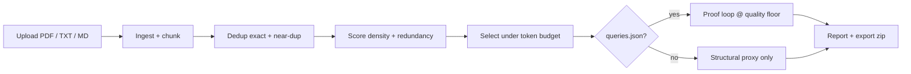

<div align="center">

  

  <p><strong>The input gate before embedding spend.</strong></p>

  <p>
    Upload a corpus → autonomous agents scan for redundancy → compress to the largest safe cut →
    prove understanding is still above your quality floor — <em>before</em> you pay for embeddings, inference, or training.
  </p>

  <p>
    <a href="https://github.com/tuntharm/Datter-AI"></a>
    <a href="https://github.com/tuntharm/Datter-AI"></a>
    <a href="https://github.com/tuntharm/Datter-AI"></a>
    <a href="HACKATHON.md"></a>
  </p>

</div>

---

## Meet Datter

<p align="center">
  
</p>

**Datter.ai** finds the largest token cut you can make to your AI data while keeping downstream understanding above your quality floor.

Most teams pay to embed, label, fine-tune, or train on everything. A large share is redundant, near-duplicate, or low-signal. Datter audits the corpus first, selects a minimum-sufficient subset under a token budget, and exports an optimised corpus with an audit trail — so you only spend on data that still answers the questions that matter.

Built for RAG teams, ML engineers, and document-heavy orgs who need **proof**, not just a compression ratio.

---

## Dashboard at a glance

<p align="center">
  
</p>

<p align="center"><em>Upload <code>managing_public_money.pdf</code> or pick a sample project — three outcome cards on one screen: compression, quality retained, and projected savings.</em></p>

| Panel | What it shows |
| --- | --- |
| **A · Compression** | Max safe token cut and before/after token count |
| **B · Quality retained** | Q&A understanding at that cut (eval harness) or structural proxy when no queries are attached |
| **C · ROI / savings** | Avoidable embedding spend identified from your cost assumptions |

Tabs underneath cover **Proof** (per-question scores), **Export** (optimised `.zip`), **Executive** (business model), and **Audit** (agent log + chunk table).

---

## What it does

- **Upload-first** — drag PDF, TXT, or MD files; agents scan automatically (no manual pipeline steps)
- **7 autonomous agents** — Ingest → Chunk → Dedup → Score → Select → Eval → Report
- **Task-conditioned selection** — relevance boost from `queries.json` when you define downstream questions
- **Proof loop** — offline TF-IDF retrieval + token-overlap judge (or LLM judge when API keys are set)
- **Optimised export** — `.zip` of selected `.txt` chunks + `manifest.json`, plus Markdown/JSON audit reports
- **Sample corpora** — Government, Social, Engineering, Science, and a fast Lab dataset for demos

> **One-line pitch:** Datter finds the largest token cut you can make to your AI data while keeping downstream understanding above your quality floor — before you spend on embeddings, inference, or training.

---

## Product status

| Area | Status | Notes |
| --- | --- | --- |
| Upload + auto-scan | **Working** | Streamlit hands-off flow |
| Structural audit (dedup, density, cost) | **Working** | Baseline heuristic scorer |
| Token-budget selection | **Working** | Datter cut vs random at budget |
| Proof loop (`queries.json`) | **Working** | Offline proxy; LLM judge optional |
| Known-demo PDF auto-match | **Working** | Re-uploaded sample PDFs wire eval automatically |
| Optimised corpus export | **Working** | Zip + manifest |
| Adisorn complexity model | **Planned** | Plugin slot exists; model files not bundled |
| S3 / SQL / Kafka connectors | **UI placeholder** | Shown as coming soon |
| Auth, billing, multi-tenant | **Out of scope (MVP)** | Local-first hackathon build |

### Example proof result (Government sample)

On `managing_public_money.pdf` with Treasury compliance questions:

| Metric | Value |
| --- | --- |
| Max safe cut @ 90% quality floor | **50%** |
| Q&A understanding retained | **90.1%** |
| Full corpus tokens → optimised | 131k → 46k |

*Demo disclaimer: sample projects use an offline understanding proxy. Production claims require the full eval harness with representative client queries.*

---

## How it works



**Selection engine** is the core: score chunks for marginal value, pack the highest-signal set into a token budget, then verify (or estimate) that downstream Q&A understanding still clears your floor.

---

## Try sample corpora

Use the sidebar **Try sample** buttons, or upload a file that matches a known demo PDF (filename or byte fingerprint).

| Project | Corpus | Eval questions |
| --- | --- | --- |
| **Government** | `managing_public_money.pdf` | Treasury compliance RAG |
| **Social** | `who_social_connection.pdf` | WHO social-connection policy |
| **Engineering** | `nist_seismic_smf_guide.pdf` | NIST seismic design guide |
| **Science** | `plos_climber_x_paleoclimate.pdf` | PLOS paleoclimate paper |
| **Lab** | `demo_data/` mixed files | Fast structural audit (~2s) |

Each vertical ships with `queries.json` and a pre-run `eval_cache.json` for instant proof-loop metrics.

---

## Quick start

### Prerequisites

- Python 3.10 or newer

### Install and run

```bash
git clone https://github.com/tuntharm/Datter-AI.git
cd Datter-AI

python3 -m venv .venv
source .venv/bin/activate
pip install -r requirements.txt

streamlit run app.py
```

Open [http://127.0.0.1:8501](http://127.0.0.1:8501).

**Fastest demo:** sidebar → **Try sample → Government** or upload `demo_verticals/government/managing_public_money.pdf`.

### Tests

```bash
pytest tests/ -q
```

---

## Repository layout

```text
Datter-AI/
├── app.py                      # Streamlit dashboard (upload gate + outcome panels)
├── assets/brand/               # Brain icon + wordmark (also in docs/assets for README)
├── docs/assets/                # README screenshots and brand images
├── datter/
│   ├── agent.py                # 7-agent streaming pipeline
│   ├── project.py              # Sample projects + upload→sample matching
│   ├── selection.py            # Token-budget cut + query relevance boost
│   ├── export.py               # Optimised corpus zip export
│   ├── eval/                   # Offline proof loop, Pareto floor, paper-summary team
│   └── scorers/                # Baseline / Adisorn / hybrid plugin interface
├── demo_verticals/             # Government, Social, Engineering, Science PDFs + queries
├── demo_data/                  # Fast lab corpus
├── scripts/                    # Compression ladder, paper-summary team runners
├── tests/                      # 30 pytest tests
├── brain/                      # Product strategy, experiments, orchestration notes
├── HACKATHON.md                # Demo script for judges / Loom
└── AGENTS.md                   # Contributor routing for humans + agents
```

---

## Scoring engines

| Mode | Description |
| --- | --- |
| **Baseline** | Heuristic redundancy, novelty, density + gzip complexity proxy |
| **Adisorn** | Wrapper for Adisorn Panasawatwong's complexity model (placeholder until model files added) |
| **Hybrid** | Blends baseline + Adisorn when the research model is loaded |

See [`models/adisorn/README.md`](models/adisorn/README.md) for model integration notes.

---

## Research grounding

Baseline signals are informed by recent data-compression and selection literature:

| Paper | Insight for Datter |
| --- | --- |
| [Kim & Baek 2024](https://arxiv.org/abs/2406.14124) | Entropy-based sample importance; low-info samples are pruning candidates |
| [ZIP-FIT 2024](https://arxiv.org/abs/2410.18194) | Gzip NCD for task-aligned selection |
| [PreSelect 2025](https://proceedings.mlr.press/v267/shum25a.html) | Compression efficiency predicts downstream value |
| [SoftDedup 2024](https://arxiv.org/abs/2407.06654) | Reweight vs hard-drop for near-duplicates |

Deeper product and experiment notes live in [`brain/02_Product/Product Spine.md`](brain/02_Product/Product%20Spine.md).

---

## 60-second demo script

1. *"AI teams pay to process everything — most of it is redundant."*
2. Upload a PDF or click **Try sample → Government** — watch the agent log on the left.
3. Point to **max safe cut**, **understanding retained**, and **avoidable embedding spend**.
4. Open **Proof** — show per-question scores at the cut.
5. Download the optimised corpus zip.
6. *"Datter.ai — we know which data matters."*

Full judge script: [`HACKATHON.md`](HACKATHON.md).

---

## Contributing

Issues and focused pull requests are welcome — especially around eval harness quality, selector improvements, and vertical demo corpora.

Before changing product direction or brain notes, read [`AGENTS.md`](AGENTS.md) and start from [`brain/00_System/Datter Brain Manager.md`](brain/00_System/Datter%20Brain%20Manager.md).

---

## License

No open-source license has been selected yet. Unless a license file is added, the repository is publicly viewable but all rights remain reserved.

---

<div align="center">

  

  <p><strong>Datter.ai</strong> — the input gate before embedding spend.</p>

  <p>
    <a href="https://github.com/tuntharm/Datter-AI">GitHub</a>
    ·
    Built for <a href="HACKATHON.md">Cursor Hands Off London 2026</a>
  </p>

</div>
