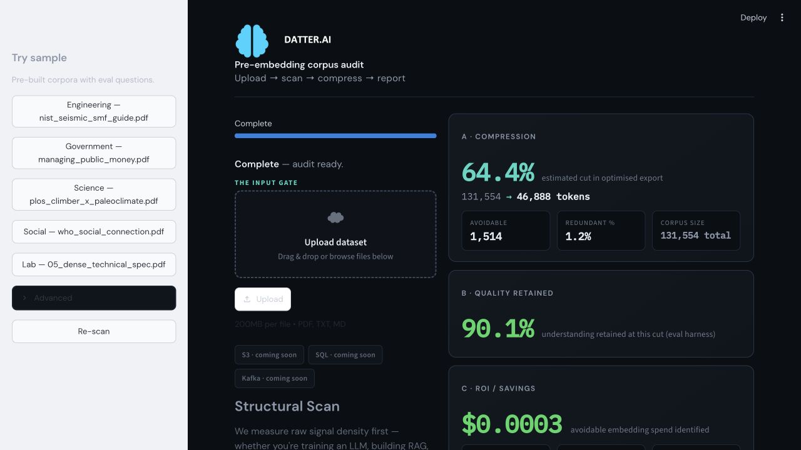
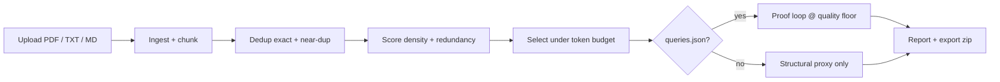

<div align="center">

  

  <p><strong>The input gate before embedding spend.</strong></p>

  <p>
    Upload a corpus → audit redundancy → select a smaller corpus → test it against your quality floor —
    <em>before</em> you pay for embeddings, inference, or training.
  </p>

  <p>
    <a href="https://github.com/tuntharm/Datter-AI"></a>
    <a href="https://github.com/tuntharm/Datter-AI"></a>
    <a href="https://github.com/tuntharm/Datter-AI/actions/workflows/ci.yml"></a>
    <a href="HACKATHON.md"></a>
  </p>

</div>

---

## Meet Datter

<p align="center">
  
</p>

**Datter.ai** audits an AI corpus for redundancy and proposes a smaller, token-budgeted subset. When you supply representative questions in `queries.json`, it can evaluate that specific cut against a configured quality floor; without questions, its output is a structural audit rather than a performance claim.

Most teams pay to embed, label, fine-tune, or train on everything. A large share is redundant, near-duplicate, or low-signal. Datter audits the corpus first, ranks chunks for a token budget, and exports the selected candidate with an audit trail. It does **not** establish a universally minimum-sufficient corpus: whether a cut is acceptable depends on the downstream task, representative evaluation set, and validation method.

Built for RAG teams, ML engineers, and document-heavy orgs who need **proof**, not just a compression ratio.

---

## Dashboard at a glance

<p align="center">
  
</p>

<p align="center"><em>The evaluated Government sample shows the export reduction, offline quality proxy, and projected cost from one reproducible run.</em></p>

| Panel | What it shows |
| --- | --- |
| **A · Compression** | Estimated token cut and before/after token count |
| **B · Quality retained** | Offline Q&A proxy for a sample with queries, or a structural proxy when no queries are attached |
| **C · ROI / savings** | Avoidable embedding spend identified from your cost assumptions |

Tabs underneath cover **Proof** (per-question scores), **Export** (optimised `.zip`), **Executive** (business model), and **Audit** (pipeline log + chunk table).

---

## What it does

- **Upload-first** — drag PDF, TXT, or MD files; the pipeline scans automatically
- **7 automated stages** — Ingest → Chunk → Dedup → Score → Select → Eval → Report
- **Task-conditioned selection** — relevance boost from `queries.json` when you define downstream questions
- **Proof loop** — offline TF-IDF retrieval + token-overlap judge (or LLM judge when API keys are set)
- **Optimised export** — `.zip` of selected `.txt` chunks + `manifest.json`, plus Markdown/JSON audit reports
- **Sample corpora** — Government, Social, Engineering, Science, and a fast Lab dataset for demos

> **One-line pitch:** Datter audits a corpus before embedding spend, then proposes a smaller candidate subset and checks it only against the quality test you provide.

---

## Product status

| Area | Status | Notes |
| --- | --- | --- |
| Upload + auto-scan | **Working** | Streamlit hands-off flow |
| Structural audit (dedup, density, cost) | **Working** | Baseline heuristic scorer |
| Token-budget selection | **Working** | Datter cut vs random at budget |
| Proof loop (`queries.json`) | **Working** | Offline proxy; LLM judge optional |
| Known-demo PDF auto-match | **Working** | Re-uploaded sample PDFs wire eval automatically |
| Optimised corpus export | **Working** | Zip + manifest |
| Adisorn complexity model | **Planned** | Plugin slot exists; model files not bundled |
| S3 / SQL / Kafka connectors | **UI placeholder** | Shown as coming soon |
| Auth, billing, multi-tenant | **Out of scope (MVP)** | Local-first hackathon build |

### Included Government-sample result — offline proxy, not production validation

The checked-in [`eval_cache.json`](demo_verticals/government/eval_cache.json) records one run on `managing_public_money.pdf` with six Treasury-compliance questions:

| Metric | Value |
| --- | --- |
| Highest passing evaluated cut in this cached run | **50.01% actual token reduction** |
| Offline Q&A proxy score at that cut | **90.1%** |
| Quality floor | **90%** |
| Judge | TF-IDF retrieval + token-overlap proxy |

Read this result narrowly: it is the highest passing cut recorded for **one bundled document and six questions** using an offline TF-IDF/token-overlap proxy. It is **not** production RAG validation, an LLM-judge result, or evidence that a 50% cut will retain quality for another corpus or task. Production claims require representative client queries and a separately validated evaluation harness.

### Inspect or rerun the bundled evidence

```bash
# Inspect the cached source record behind the dashboard metric
python -m json.tool demo_verticals/government/eval_cache.json

# Check the selection and offline-evaluation behaviour
pytest tests/test_selection.py tests/test_eval_offline.py -q

# Run a fresh Government compression ladder at the same 90% floor
python scripts/run_compression_ladder.py --project government --quality-floor 0.90
```

The last command writes `demo_verticals/government/compression_ladder.json` and its Markdown summary. The committed [ladder record](demo_verticals/government/compression_ladder.json) is a separate dated offline sweep whose tested steps topped out at 20%; it does not independently confirm the cached 50.01% result. Treat each artifact as evidence for its own run and method.

---

## How it works



**Selection engine** is the core: it scores chunks for marginal value and packs a candidate set into a token budget. With representative questions, Datter can run its configured evaluation loop; without them, it cannot verify downstream Q&A quality.

---

## Try sample corpora

Use the sidebar **Try sample** buttons, or upload a file that matches a known demo PDF (filename or byte fingerprint).

| Project | Corpus | Eval questions |
| --- | --- | --- |
| **Government** | `managing_public_money.pdf` | Treasury compliance RAG |
| **Social** | `who_social_connection.pdf` | WHO social-connection policy |
| **Engineering** | `nist_seismic_smf_guide.pdf` | NIST seismic design guide |
| **Science** | `plos_climber_x_paleoclimate.pdf` | PLOS paleoclimate paper |
| **Lab** | `demo_data/` mixed files | Fast structural audit (~2s) |

Each vertical ships with `queries.json` and a pre-run `eval_cache.json` for instant proof-loop metrics.

---

## Quick start

### Prerequisites

- Python 3.10 or newer

### Install and run

```bash
git clone https://github.com/tuntharm/Datter-AI.git
cd Datter-AI

python3 -m venv .venv
source .venv/bin/activate
pip install -r requirements.txt

streamlit run app.py
```

Open [http://127.0.0.1:8501](http://127.0.0.1:8501).

**Fastest demo:** sidebar → **Try sample → Government** or upload `demo_verticals/government/managing_public_money.pdf`.

### Tests

```bash
pytest tests/ -q
```

---

## Repository layout

```text
Datter-AI/
├── app.py                      # Streamlit dashboard (upload gate + outcome panels)
├── assets/brand/               # Brain icon + wordmark (also in docs/assets for README)
├── docs/assets/                # README screenshots and brand images
├── datter/
│   ├── agent.py                # Seven-stage streaming pipeline
│   ├── project.py              # Sample projects + upload→sample matching
│   ├── selection.py            # Token-budget cut + query relevance boost
│   ├── export.py               # Optimised corpus zip export
│   ├── eval/                   # Offline proof loop, Pareto floor, paper-summary team
│   └── scorers/                # Baseline / Adisorn / hybrid plugin interface
├── demo_verticals/             # Government, Social, Engineering, Science PDFs + queries
├── demo_data/                  # Fast lab corpus
├── scripts/                    # Compression ladder, paper-summary team runners
├── tests/                      # 30 pytest tests
├── HACKATHON.md                # Demo script for judges / Loom
└── AGENTS.md                   # Contributor routing for humans + agents
```

---

## Scoring engines

| Mode | Description |
| --- | --- |
| **Baseline** | Heuristic redundancy, novelty, density + gzip complexity proxy |
| **Adisorn** | Wrapper for Adisorn Panasawatwong's complexity model (placeholder until model files added) |
| **Hybrid** | Blends baseline + Adisorn when the research model is loaded |

See [`models/adisorn/README.md`](models/adisorn/README.md) for model integration notes.

---

## Research grounding

Baseline signals are informed by recent data-compression and selection literature:

| Paper | Insight for Datter |
| --- | --- |
| [Kim & Baek 2024](https://arxiv.org/abs/2406.14124) | Entropy-based sample importance; low-info samples are pruning candidates |
| [ZIP-FIT 2024](https://arxiv.org/abs/2410.18194) | Gzip NCD for task-aligned selection |
| [PreSelect 2025](https://proceedings.mlr.press/v267/shum25a.html) | Compression efficiency predicts downstream value |
| [SoftDedup 2024](https://arxiv.org/abs/2407.06654) | Reweight vs hard-drop for near-duplicates |

---

## 60-second demo script

1. *"AI teams pay to process everything — most of it is redundant."*
2. Upload a PDF or click **Try sample → Government** — watch the pipeline log on the left.
3. Point to **estimated cut**, **quality retained**, and **avoidable embedding spend**.
4. Open **Proof** — show per-question scores at the cut.
5. Download the optimised corpus zip.
6. *"Datter.ai — test which data still matters before paying to process all of it."*

Full judge script: [`HACKATHON.md`](HACKATHON.md).

---

## Feedback

Feedback and issues are welcome, especially around evaluation quality, selection methods, and representative demo corpora.

The repository is source-available but not currently open source. Please do not reuse or redistribute the code without permission.

---

## License

No open-source license has been selected yet. Unless a license file is added, the repository is publicly viewable but all rights remain reserved.

---

<div align="center">

  

  <p><strong>Datter.ai</strong> — the input gate before embedding spend.</p>

  <p>
    <a href="https://github.com/tuntharm/Datter-AI">GitHub</a>
    ·
    Built for <a href="HACKATHON.md">Cursor Hands Off London 2026</a>
  </p>

</div>
