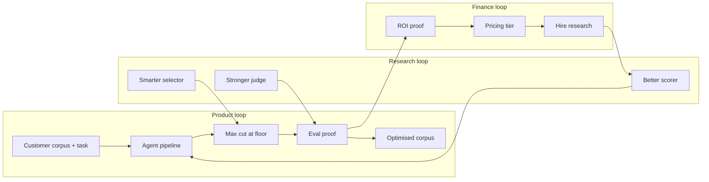

# Business Model & Finance

The company is a **selection engine** that sells **maximum token reduction at a customer-chosen quality floor** — not blind deletion, not fixed 50% cuts for everyone.

## One-line business model

> **You pick the quality floor (e.g. 90–100% understanding). Datter finds the largest token cut that preserves it — and keeps improving that frontier as research sharpens scoring.**

## What we sell

| Layer | Customer buys | Datter delivers |
|---|---|---|
| **Wedge (free)** | Curiosity | Local structural audit + hands-off agents |
| **Standard** | RAG token savings | Max cut @ 90% floor + audit export |
| **Assured** | Regulated KB | Max cut @ 95% floor + project manifest |
| **Governed** | Bank / VPC | Max cut @ 99% floor + governance trail |
| **Research uplift** | Better frontier | New scorers (Adisorn, hybrid, task-conditioned) push max cut **up** at same floor |

**Pricing unit:** per **project** (scoped corpus + task + eval set) or per **M tokens analysed**, tiered by quality floor.

## The Pareto product (core economics)

```text
Quality (understanding %)
  100% |●  full corpus
       | \
       |  \  ← Datter frontier (improves with research)
       |   ●── max safe cut @ floor
  floor|························
       |        ● random cut (same tokens, worse quality)
       +──────────────────────── Token reduction %
            0%              XX%  ← what we maximise
```

**Extreme case (north star):** drop **XX% of tokens** while retaining **100% understanding** on the eval set. XX rises as scoring + selection improve.

Tonight's demo uses an **offline proxy** for understanding. Production uses LLM answer + judge ([[Proof Loop Spec]]). The **business claim** is always tied to the eval harness — never to structural guesses alone.

## Flywheel (how the business compounds)



1. **Win project** — corpus + eval questions scoped ([[Project Model]]).
2. **Run agents** — find max safe cut at customer's quality floor.
3. **Prove** — understanding % vs random at same token budget.
4. **Export** — optimised corpus + audit (customer embeds less, pays Datter).
5. **Reinvest** — better scorer / selector / judge → **higher XX% at same floor**.
6. **Upsell tier** — 90% → 95% → 99% floor for regulated buyers.

## Agent company (who does what)

| Agent / team | Role in business model |
|---|---|
| **Ingest → Report pipeline** | Deliver audit + cut + export (product) |
| **EvalAgent** | Prove cut is safe; defines what "quality floor" means |
| **SelectAgent + Pareto scan** | Find max XX% at floor (the SKU) |
| **Research team (Adisorn, M2, M3)** | Push frontier outward — **more tokens saved at same accuracy** |
| **CFO** | ROI narrative, pricing tiers, executive tab |
| **CPO** | Project-first UX, outcome-before-tables |
| **CEO** | Orchestrate; customer picks floor; compact at deadline |

Agents do not chat in fiction — they hand off via [[HANDOFF]] and [[REQUESTS]]. The **improvement loop** is: Eval results → Research backlog → Scorer upgrade → higher max cut.

## Finance metrics (per project)

| Metric | Formula / source |
|---|---|
| Tokens analysed | Pipeline |
| **Max safe reduction %** | Pareto scan @ quality floor |
| Tokens removed | full − optimised |
| $ saved | removed × (token + embed $/M) |
| Understanding @ cut | EvalAgent |
| Meets floor? | understanding ≥ floor |
| **Frontier delta vs random** | Datter understanding − random understanding |

**Executive sentence:** see [[Executive Finance Report]].

## Research hiring thesis (when to invest)

Hire / fund research when:

1. Eval shows **floor is met** but **max cut is low** → selector + task relevance (M2, M3).
2. Eval shows **cut is high** but **floor missed** → conservative; need better scorer (Adisorn, hybrid).
3. **Random beats Datter** on eval → scoring has no downstream signal; priority fix before sales.

Goal of research: **minimise tokens kept** (maximise drop) subject to **understanding ≥ floor**. Not "delete more blindly" — **move the Pareto frontier up-left**.

## GTM link

See [[Business Strategy]] Phase 1 wedge: AI builder about to embed RAG corpus.

**Pitch:** "We removed **XX%** of tokens. Your support bot still answers **YY%** as well as the full corpus on your test questions. Random cut at the same size only scored **ZZ%**."

## Deferred (not the business tonight)

- Datacenter as primary ICP (channel later)
- CNN / training-accuracy eval (ML-lab buyer)
- Supabase billing (session-state demo OK)

## Cross-agent notes (2026-06-25)

**[CFO → Research]** Price tiers attach to quality floor. Research that lifts max cut @ 90% directly increases Standard tier value.

**[Research → CTO]** Adisorn + task-conditioned scoring (M3) should increase max_safe_reduction_pct on gov PDF without dropping below floor.

**[CPO → CEO]** Executive tab must show **max safe cut %** and **meets floor** — that's the product SKU, not raw avoidable %.

**[CTO → CFO]** Pareto scan implemented in `datter/eval/pareto.py`; SelectAgent finds max cut before EvalAgent records proof.

## Paper Summary Team → pricing

[[Paper Summary Team]] runs the **multi-model exam loop** (gpt / opus / sonnet / composer) on full vs compressed corpus. Output is a **Pareto point**: `(compression_pct, min_score_across_models)`.

| Exam outcome | Tier fit | AI lab pitch |
|---|---|---|
| ≥99% min score @ max cut | **Governed** | Regulated KB, audit trail |
| ≥95% @ ≥50% compression | **Assured** | Production RAG embed |
| ≥90% @ ≥50% compression | **Standard** | Design partner pilot |
| &lt;90% or high compression + low score | **Research / fix** | Do not sell — tune scorer or lower cut |

**Pricing study (ICP = AI lab):** Plot score drop vs token save across floors. Example: if 80% token save holds 90% understanding (100%→90%), Standard tier is viable at $/M analysed; if only 70% save holds 90%, price research uplift until frontier moves.

Business team uses `exam_results.json` + Executive tab Pareto to quote **max safe cut @ chosen floor** — never quote compression without paired exam score.

Code: `scripts/run_paper_summary_team.py`, `datter/eval/paper_summary_team.py`.

## Links

- Up: [[Orchestration Plan]]
- Executive one-pager: [[Executive Finance Report]]
- Product: [[Product Spine]]
- Proof: [[Proof Loop Spec]]
- GTM: [[Business Strategy]]
