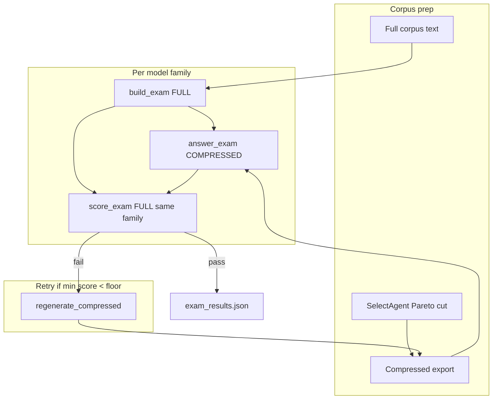

# Multi-Model Exam Loop

Technical flow for [[Paper Summary Team]] — full vs compressed corpus exam per model family.

## Flow diagram



## Model IDs (API)

Use these slugs via `datter/eval/llm_judge.py` `ModelSpec`:

| Family | Provider | Primary API id | Fallback / note |
|---|---|---|---|
| `gpt55` | OpenAI | `gpt-4o` | gpt-5.5 not on public API; o3-mini optional for cost |
| `opus` | Anthropic | `claude-opus-4-6` | Latest opus slug |
| `sonnet` | Anthropic | `claude-sonnet-4-6` | Fast examiner for high-volume corpora |
| `composer` | OpenAI | `gpt-4o-mini` | Cursor Composer is internal; mini stand-in |

## Environment

```bash
export OPENAI_API_KEY=sk-...
export ANTHROPIC_API_KEY=sk-ant-...
python scripts/run_paper_summary_team.py --project lab
python scripts/run_paper_summary_team.py --project government --quality-floor 0.90
```

Without keys: offline TF-IDF judge; results JSON includes `"api_mode": "offline"`.

## Production modes

| Mode | Trigger | Output |
|---|---|---|
| **A — API keys** | `OPENAI_API_KEY` and/or `ANTHROPIC_API_KEY` set | Automated loop via provider APIs (`run_paper_summary_team.py`) |
| **B — Cursor orchestrator** | No keys, or explicit Cursor replay | `exam_corpus/` + `exam_prompts/<slug>.md` per model; optional orchestrator-simulated scores in `exam_results_cursor.json` |

Cursor model slugs (distinct families, one examiner/examinee pair each):

| Family | Cursor slug |
|---|---|
| `gpt55` | `gpt-5.5-medium` |
| `opus` | `claude-opus-4-8-thinking-high` |
| `sonnet` | `claude-4.6-sonnet-medium-thinking` |
| `composer` | `composer-2.5-fast` |

API fallbacks when keys are set but Cursor-internal models are unavailable: see table above (`gpt-4o`, `claude-opus-4-6`, etc.).

## Running in Cursor (multi-model)

When you want **real** multi-model comparison inside Cursor (not API stand-ins):

1. Export corpus + prompts (works without keys):

```bash
cd /Users/tharm/dev/datter && source .venv/bin/activate
python scripts/run_paper_summary_cursor_team.py --project lab
```

2. Open **four Cursor chats**, each with a different model selected:
   - `gpt-5.5-medium`
   - `claude-opus-4-8-thinking-high`
   - `claude-4.6-sonnet-medium-thinking`
   - `composer-2.5-fast`

3. Paste the matching prompt from `demo_data/exam_prompts/<slug>.md` (or `exam_prompts/` under any project corpus path).

4. Compare answers against reference answers embedded in each prompt, or re-run scoring with API keys.

**Automated alternative** — set provider keys and run either script; both delegate to the same exam loop:

```bash
export OPENAI_API_KEY=sk-...
export ANTHROPIC_API_KEY=sk-ant-...
python scripts/run_paper_summary_team.py --project lab --quality-floor 0.90
python scripts/run_paper_summary_cursor_team.py --project lab --quality-floor 0.90
```

Without keys, `run_paper_summary_cursor_team.py` writes honest `exam_results_cursor.json` tagged per model slot with `"api_mode": "cursor_simulated"` and the disclaimer that scores used the offline TF-IDF judge (same logic as CI).

**Cursor subagent path:** a parent agent can spawn four parallel Task subagents, each with a different `model` slug, passing the corresponding `exam_prompts/<slug>.md` as the task prompt. That is true multi-model inside Cursor without API spend.

## Module map

| Function | Module | Role |
|---|---|---|
| `run_paper_summary_cursor_team.py` | CLI | Cursor export + multi-model replay |
| `write_cursor_exam_prompts` | `paper_summary_team.py` | Emit `exam_prompts/<slug>.md` |
| `run_cursor_simulated_eval` | `paper_summary_team.py` | Offline per-slot scores when no keys |
| `CURSOR_MODEL_SLUGS` | `llm_judge.py` | Family → Cursor Task slug |
| `build_exam` | `paper_summary_team.py` | FULL examiner — questions + references |
| `answer_exam` | `paper_summary_team.py` | COMPRESSED examinee |
| `score_exam` | `paper_summary_team.py` | FULL scorer (same family) |
| `run_team_loop` | `paper_summary_team.py` | Orchestrate roster + retry |
| `regenerate_compressed` | `paper_summary_team.py` | Tighter keep on fail |
| `llm_complete` | `llm_judge.py` | Unified OpenAI + Anthropic call |
| `get_model_roster` | `llm_judge.py` | Family → API routing |
| `run_eval_at_quality_floor` | `pareto.py` | Initial selection |
| `apply_query_relevance_boost` | `relevance_boost.py` | Retry boost |
| `build_optimised_corpus` | `export.py` | Compressed text export |

## Pass criteria

- **Per model:** mean question score ≥ `quality_floor × 100`
- **Team pass:** `min(mean_score)` across roster ≥ floor
- **Default floor:** 1.0 (100%) for north-star; `--quality-floor 0.90` for Standard tier pilots

## Token accounting

Recorded per model result:

- `tokens_full` — word-count proxy on full corpus text
- `tokens_compressed` — word-count proxy on optimised export
- `compression_pct` — `(1 - compressed/full) × 100`

Exam inference tokens (API spend) are future work; tonight records corpus context size only.

## Links

- Spec: [[Paper Summary Team]]
- Pricing: [[Business Model & Finance]]
- Proof baseline: [[Proof Loop Spec]]
