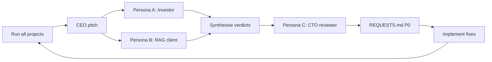

# Multi-Model Review Loop

Process for simulating investor, client, and CTO personas against live product metrics — then feeding P0 work to engineering and research.

## Loop diagram



## Personas

### Persona A — Skeptical investor (AI infra VC)

**Prompt:** Is proof credible? Would this survive seed diligence?

**Round 1 critique (2026-06-25 data)**

| Check | Result | Notes |
|---|---|---|
| Floor met on vertical PDFs | **4/4 pass** | Gov 90.1%, Eng 96.1%, Sci 91.6%, Social 94.7% |
| Floor met on Lab | **Fail** | 85.9% @ 40.9% cut — below 90% floor |
| Datter beats random | **Fail all 5** | 0 pp delta everywhere |
| Frontier lift vs pre-fix | **Partial** | Gov: 20%→50% max cut after relevance boost; still ties random |
| Production judge | **Missing** | Blocker for fundable claim |

**Verdict:** Do not sell universal "beats random" until delta > 0 on ≥2 projects with LLM judge.

---

### Persona B — RAG client (AI company lead)

**Prompt:** Would I embed the optimised corpus?

**Round 1 critique**

| Project | Max cut | Embed? | Reason |
|---|---:|---|---|
| Government | 50.0% | *Maybe pilot* | Meets floor; export + audit needed; random tie weakens ROI story |
| Engineering | 45.3% | *Maybe* | Strong understanding headroom |
| Science | 61.2% | *Yes for demo* | Best max cut @ floor tonight |
| Social | 20.0% | *No* | Low cut; dense UN-style PDF — little token savings |
| Lab | 40.9% | *Structural only* | Misses floor; good for duplicate story, not eval SLA |

**Verdict:** Would pilot **Science + Government** exports; require manifest per dropped chunk and production eval before production embed.

---

### Persona C — CTO reviewer

**Prompt:** What's broken technically?

**Round 1 findings → REQUESTS P0**

| ID | Finding | Severity | Status |
|---|---|---|---|
| R1 | Random ties Datter on all projects (selection has no eval margin) | P0 | Partial fix — relevance boost; delta still 0 |
| R2 | Lab misses 90% floor (85.9%) | P0 | Open — eval questions + selector |
| R3 | Stale eval caches missing `max_safe_reduction_pct` | P1 | **Fixed** — deleted + invalidation guard |
| R4 | Baseline scorer ignores task/queries | P0 | **Fixed v1** — `relevance_boost.py` |
| R5 | Social max cut stuck at 20% | P1 | Research — task-conditioned + Adisorn |
| R6 | No production LLM judge | P0 | **Stub** — `llm_judge.py`; wire into loop + run with API key |

---

## Iteration gate

**Stop condition (sales-ready eval):**

```text
(Datter understanding − random understanding) > 0 pp
AND meets_quality_floor = true
on lab AND government
```

**Round 1 status:** **Not met.** Gov meets floor but ties random. Lab fails floor.

**Honest blockers for round 2**

1. Budget-matched random on dense PDFs is surprisingly strong on TF-IDF proxy — need **marginal selector (M2)** that optimises per-question gold_hint recall, not global usefulness.
2. Lab eval set asks about duplicates while selector drops non-canonical dupes — **misaligned eval** depresses understanding.
3. Production judge required before client/investor will treat numbers as contractual.

---

## Feedback → REQUESTS.md workflow

1. Run product on all projects (see [[CEO Review Meeting 2026-06-25]] metrics table).
2. Each persona produces verdict + bullet critiques.
3. CTO maps critiques to P0/P1 in `brain/REQUESTS.md`.
4. Implement minimum viable fixes (1–3 per round).
5. Delete stale `eval_cache.json` when pareto fields missing; re-run.
6. Repeat until gate met or blockers documented.

---

## Round 2 checklist

- [x] Query relevance boost in `select_datter_cut()` — `queries_path` param
- [x] LLM judge stub (`datter/eval/llm_judge.py`) — offline fallback, no API key required
- [x] Delete stale caches; re-run all 5 projects
- [ ] M2 greedy marginal selector under token budget
- [ ] Lab `queries.json` — duplicate-aware gold hints aligned with canonical chunk policy
- [ ] LLM judge wired into `run_eval_loop` + gov/lab proof run (needs API key)
- [ ] Re-run review loop; update [[CEO Review Meeting 2026-06-25]] when delta > 0
- [ ] If delta still 0: document as research problem, do not widen sales claim

## Links

- [[CEO Review Meeting 2026-06-25]]
- [[Proof Loop Spec]]
- [[Business Model & Finance]]
- `REQUESTS.md`
